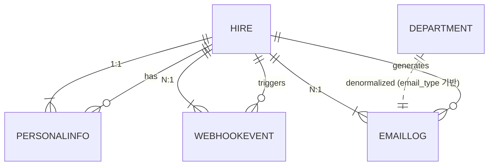

## 1. 🧱 Entity 정의 (Entity Definitions)

아래는 시스템의 핵심 엔터티입니다.

| 엔터티                 | 설명                        |
| ------------------- | ------------------------- |
| **Hire**            | 입사자 기본 정보                 |
| **PersonalInfo**    | 입사자의 자기기입 정보 (보험, 검진, 설문) |
| **Department**      | 각 부서 정보 (이메일 자동화 대상)      |
| **EmailLog**        | 이메일 발송 이력 관리              |
| **WebhookEvent**    | Make.com과의 통신 이력 저장       |
| **UserRole** *(옵션)* | 향후 권한 확장을 위한 사전 정의 테이블    |

---

## 2. 🧾 속성 정의 (Attribute Specifications)

### ✅ Hire

| 필드명            | 타입           | 제약 조건        |
| -------------- | ------------ | ------------ |
| id             | UUID (PK)    | PRIMARY KEY  |
| name           | VARCHAR(100) | NOT NULL     |
| department     | VARCHAR(100) | NOT NULL     |
| manager        | VARCHAR(100) | NOT NULL     |
| title          | VARCHAR(100) |              |
| start\_date    | DATE         | NOT NULL     |
| contact        | VARCHAR(50)  |              |
| probation\_end | DATE         |              |
| deleted\_at    | TIMESTAMP    | Soft-delete용 |

**Note:** `(name, start_date)` 복합 유니크 인덱스 존재

---

### ✅ PersonalInfo

| 필드명                   | 타입           | 제약 조건               |
| --------------------- | ------------ | ------------------- |
| id                    | UUID (PK)    | PRIMARY KEY         |
| hire\_id              | UUID (FK)    | REFERENCES hire(id) |
| insurance\_dependents | JSONB        | 배열 구조, 암호화 필요       |
| health\_hospital      | VARCHAR(100) |                     |
| health\_date          | DATE         |                     |
| survey\_good          | TEXT         |                     |
| survey\_pain          | TEXT         |                     |

---

### ✅ Department

| 필드명   | 타입           | 제약 조건       |
| ----- | ------------ | ----------- |
| id    | SERIAL (PK)  | PRIMARY KEY |
| name  | VARCHAR(100) | UNIQUE      |
| email | VARCHAR(150) | NOT NULL    |

---

### ✅ EmailLog

| 필드명         | 타입           | 제약 조건                                |
| ----------- | ------------ | ------------------------------------ |
| id          | UUID (PK)    | PRIMARY KEY                          |
| hire\_id    | UUID (FK)    | REFERENCES hire(id)                  |
| email\_type | VARCHAR(100) | (예: dept\_welcome, health\_notice 등) |
| sent\_at    | TIMESTAMP    | DEFAULT now()                        |
| status      | VARCHAR(20)  | (예: success, failed, retry)          |

**Note:** 통계 용도 최적화를 위해 약간의 비정규화 허용 가능

---

### ✅ WebhookEvent

| 필드명              | 타입        | 제약 조건               |
| ---------------- | --------- | ------------------- |
| id               | UUID (PK) | PRIMARY KEY         |
| hire\_id         | UUID (FK) | REFERENCES hire(id) |
| endpoint         | TEXT      | NOT NULL            |
| payload          | JSONB     | Webhook 송신 내용       |
| response\_status | INTEGER   | HTTP Status         |
| retries          | SMALLINT  | 기본 0, 최대 3          |

---

### ✅ UserRole *(Optional)*

| 필드명         | 타입           | 제약 조건       |
| ----------- | ------------ | ----------- |
| role\_id    | SERIAL (PK)  | PRIMARY KEY |
| description | VARCHAR(100) |             |

---

## 3. 🔗 관계 매핑 (Relationship Mappings)

| 관계                      | 설명                 |
| ----------------------- | ------------------ |
| Hire 1 ⟶ 1 PersonalInfo | 입사자당 자기기입 정보 1개    |
| Hire 1 ⟶ N EmailLog     | 입사자당 여러 발송 이력      |
| Hire 1 ⟶ N WebhookEvent | 입사자당 여러 Webhook 호출 |
| EmailLog N ⟶ 1 Hire     | 이메일은 입사자에 소속됨      |
| WebhookEvent N ⟶ 1 Hire | 이벤트도 입사자 기준으로 추적   |

---

## 4. 🗝️ Primary / Foreign Key 구조



---

## 5. 🧭 인덱스 전략 (Index Strategy)

| 테이블          | 인덱스 필드                 | 목적                 |
| ------------ | ---------------------- | ------------------ |
| Hire         | `(start_date)`         | 기간 조회 속도 개선        |
| Hire         | `(name, start_date)`   | 중복 검출 방지           |
| EmailLog     | `(hire_id)`            | 입사자 기준 필터링 최적화     |
| WebhookEvent | `(hire_id)`            | 이벤트 히스토리 조회용       |
| EmailLog     | `(email_type, status)` | 통계 및 모니터링 필터 속도 개선 |

---

## 6. 📏 제약 조건 및 비즈니스 규칙 (Constraints & Business Rules)

* `hire`는 soft-delete (`deleted_at IS NULL`) 기준으로 유일성 유지
* `PersonalInfo.hire_id`는 UNIQUE (1:1 관계)
* 모든 외부 통신(Webhook)은 TLS 필수
* Webhook 실패 시 최대 3회 재시도 (지수 백오프)
* RLS 정책은 `user_role` 기반으로 미래 확장 가능
* 이메일/이벤트 로그는 1년간 보관 후 별도 백업 정책 적용

---

## 7. 🧬 데이터 타입 및 유효성 규칙 (Data Types and Validation Rules)

| 필드                    | 검증 규칙                           |
| --------------------- | ------------------------------- |
| start\_date           | 과거 날짜 허용 (예외 상황 검토)             |
| insurance\_dependents | JSONB 배열, 주민번호 마스킹 또는 암호화 필요    |
| health\_date          | `>= CURRENT_DATE` 검증            |
| email\_type           | ENUM 대체 또는 제한 리스트 관리            |
| retries               | CHECK (retries BETWEEN 0 AND 3) |

---

## 8. 🧮 정규화 분석 (Normalization Analysis)

* 전반적 기준은 **3NF(제3정규형)** 충족
* `EmailLog`는 통계/분석을 위해 비정규화 컬럼 추가 고려 (e.g., department\_name)
* `insurance_dependents`는 별도 테이블 분리 가능하나, 현재는 JSONB로 간략화 (낮은 볼륨 전제)

---

## 9. 🚀 성능 최적화 고려사항 (Performance Optimization)

* 모든 조인 대상 테이블은 FK 및 인덱스 포함
* Supabase는 기본적으로 RLS + JSONB 지원 최적화
* Webhook은 비동기 큐 또는 Supabase Edge Functions로 확장 가능
* 통계 패널 전용 뷰(View) 또는 Materialized View 활용 고려
* Sample Query:

```sql
SELECT name, start_date, COUNT(e.id) as email_sent
FROM hire h
JOIN email_log e ON h.id = e.hire_id
GROUP BY h.id
ORDER BY start_date DESC;
```

> **목표 응답 시간:** 200ms 이하 (연간 250\~500건 예상)

---

## 10. 🔄 마이그레이션 및 버전 관리 전략 (Migration and Versioning Strategy)

| 항목        | 내용                                             |
| --------- | ---------------------------------------------- |
| 마이그레이션 도구 | Supabase CLI 또는 Prisma Migrate (선택 가능)         |
| 버전 관리     | Git + migration 스크립트 분리 추적                     |
| 변경 기록     | ERD 변경 시 DDL + ER 변경 로그 보관                     |
| 배포 전략     | staging → production 단계별 적용 + Rollback plan 필요 |